# Service Status

Public uptime checks and incident history managed by [vigilant-broccoli](https://github.com/iamharryliu/vigilant-broccoli).

## Table of Contents

- [Service Status](#service-status)
- [Management](#management)

## Service Status

<!--start: status pages-->
<!-- This summary is generated by Upptime (https://github.com/upptime/upptime) -->
<!-- Do not edit this manually, your changes will be overwritten -->
<!-- prettier-ignore -->
| URL | Status | History | Response Time | Uptime |
| --- | ------ | ------- | ------------- | ------ |
|  [staging-docs](https://staging-docs-md.pages.dev/) | 🟩 Up | [staging-docs.yml](https://github.com/iamharryliu/uptime/commits/HEAD/history/staging-docs.yml) | 

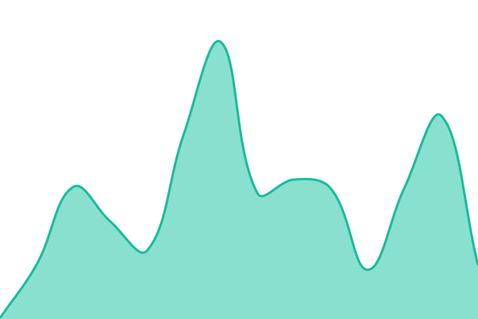 133ms
     
 | 

<a href="https://upptime.harryliu.dev/history/staging-docs">100.00%</a>
    

|  [staging-context](https://staging-context-md.pages.dev/) | 🟩 Up | [staging-context.yml](https://github.com/iamharryliu/uptime/commits/HEAD/history/staging-context.yml) | 

 235ms
     
 | 

<a href="https://upptime.harryliu.dev/history/staging-context">100.00%</a>
    

|  [staging-links](https://staging-links-react.pages.dev/) | 🟩 Up | [staging-links.yml](https://github.com/iamharryliu/uptime/commits/HEAD/history/staging-links.yml) | 

 151ms
     
 | 

<a href="https://upptime.harryliu.dev/history/staging-links">100.00%</a>
    

|  [staging-cloud-8-skate](https://staging-cloud-8-skate-react.pages.dev/) | 🟩 Up | [staging-cloud-8-skate.yml](https://github.com/iamharryliu/uptime/commits/HEAD/history/staging-cloud-8-skate.yml) | 

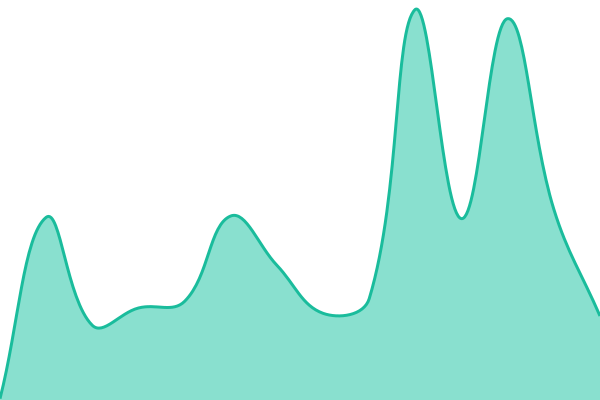 127ms
     
 | 

<a href="https://upptime.harryliu.dev/history/staging-cloud-8-skate">100.00%</a>
    

|  [staging-harryliu-dev](https://staging-harryliu-dev-react.pages.dev/) | 🟩 Up | [staging-harryliu-dev.yml](https://github.com/iamharryliu/uptime/commits/HEAD/history/staging-harryliu-dev.yml) | 

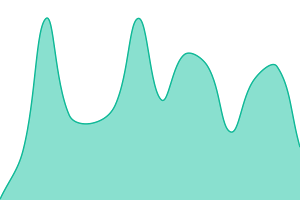 129ms
     
 | 

<a href="https://upptime.harryliu.dev/history/staging-harryliu-dev">100.00%</a>
    

|  [staging-harryliu-dev-resume](https://staging-harryliu-dev-react.pages.dev/resume) | 🟩 Up | [staging-harryliu-dev-resume.yml](https://github.com/iamharryliu/uptime/commits/HEAD/history/staging-harryliu-dev-resume.yml) | 

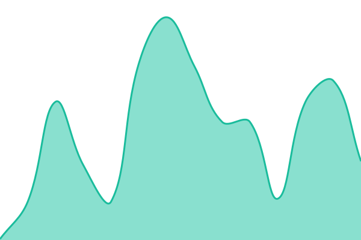 109ms
     
 | 

<a href="https://upptime.harryliu.dev/history/staging-harryliu-dev-resume">100.00%</a>
    

|  [staging-findme](https://staging-findme.vercel.app/) | 🟩 Up | [staging-findme.yml](https://github.com/iamharryliu/uptime/commits/HEAD/history/staging-findme.yml) | 

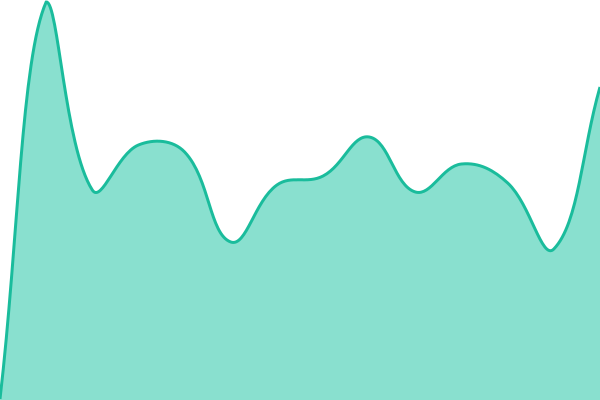 238ms
     
 | 

<a href="https://upptime.harryliu.dev/history/staging-findme">100.00%</a>
    

|  [staging-hearth](https://staging-hearth.vercel.app/login) | 🟩 Up | [staging-hearth.yml](https://github.com/iamharryliu/uptime/commits/HEAD/history/staging-hearth.yml) | 

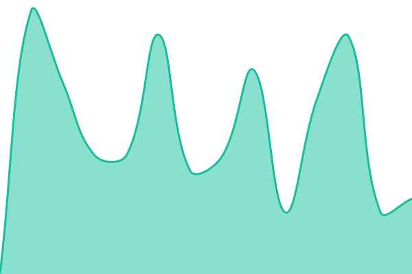 319ms
     
 | 

<a href="https://upptime.harryliu.dev/history/staging-hearth">100.00%</a>
    

|  [staging-service-manager](https://staging-vb-express.fly.dev/) | 🟩 Up | [staging-service-manager.yml](https://github.com/iamharryliu/uptime/commits/HEAD/history/staging-service-manager.yml) | 

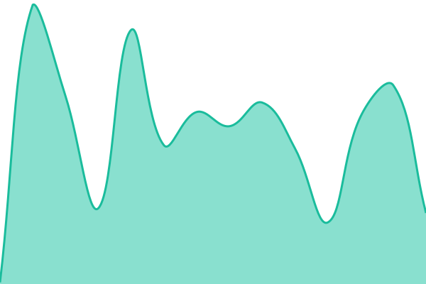 103ms
     
 | 

<a href="https://upptime.harryliu.dev/history/staging-service-manager">100.00%</a>
    

|  [staging-component-library](https://staging-component-library.pages.dev/) | 🟩 Up | [staging-component-library.yml](https://github.com/iamharryliu/uptime/commits/HEAD/history/staging-component-library.yml) | 

 127ms
     
 | 

<a href="https://upptime.harryliu.dev/history/staging-component-library">100.00%</a>
    

|  [staging-utilities](https://staging-utilities-ui.pages.dev/) | 🟩 Up | [staging-utilities.yml](https://github.com/iamharryliu/uptime/commits/HEAD/history/staging-utilities.yml) | 

 189ms
     
 | 

<a href="https://upptime.harryliu.dev/history/staging-utilities">100.00%</a>
    

|  [staging-whiteboard](https://staging-whiteboard.vercel.app/) | 🟩 Up | [staging-whiteboard.yml](https://github.com/iamharryliu/uptime/commits/HEAD/history/staging-whiteboard.yml) | 

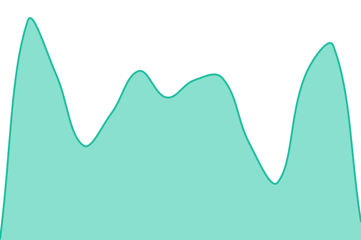 292ms
     
 | 

<a href="https://upptime.harryliu.dev/history/staging-whiteboard">100.00%</a>
    

|  [staging-weather](https://staging-weather-next.vercel.app/) | 🟩 Up | [staging-weather.yml](https://github.com/iamharryliu/uptime/commits/HEAD/history/staging-weather.yml) | 

 169ms
     
 | 

<a href="https://upptime.harryliu.dev/history/staging-weather">100.00%</a>
    

|  [staging-vb-manager-next-mobile](https://staging-vb-manager-next-mobile.vercel.app/login) | 🟩 Up | [staging-vb-manager-next-mobile.yml](https://github.com/iamharryliu/uptime/commits/HEAD/history/staging-vb-manager-next-mobile.yml) | 

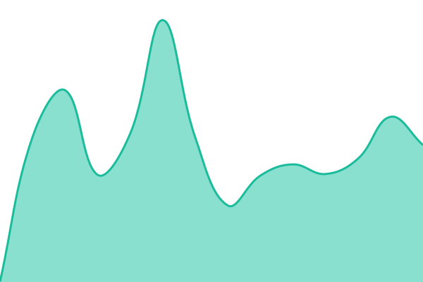 335ms
     
 | 

<a href="https://upptime.harryliu.dev/history/staging-vb-manager-next-mobile">100.00%</a>
    

|  [production-cloud-8-skate](https://cloud8skate.com/) | 🟩 Up | [production-cloud-8-skate.yml](https://github.com/iamharryliu/uptime/commits/HEAD/history/production-cloud-8-skate.yml) | 

 181ms
     
 | 

<a href="https://upptime.harryliu.dev/history/production-cloud-8-skate">100.00%</a>
    

|  [production-harryliu-dev](https://harryliu.dev/) | 🟩 Up | [production-harryliu-dev.yml](https://github.com/iamharryliu/uptime/commits/HEAD/history/production-harryliu-dev.yml) | 

 149ms
     
 | 

<a href="https://upptime.harryliu.dev/history/production-harryliu-dev">100.00%</a>
    

|  [production-harryliu-dev-resume](https://harryliu.dev/resume) | 🟩 Up | [production-harryliu-dev-resume.yml](https://github.com/iamharryliu/uptime/commits/HEAD/history/production-harryliu-dev-resume.yml) | 

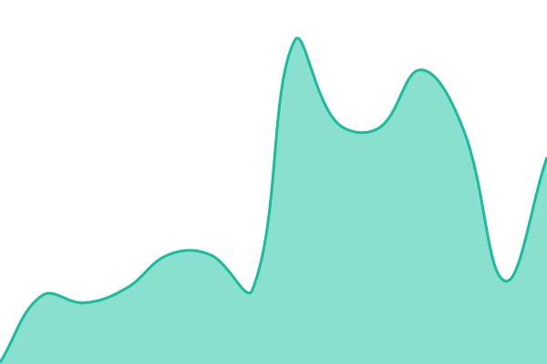 112ms
     
 | 

<a href="https://upptime.harryliu.dev/history/production-harryliu-dev-resume">100.00%</a>
    

|  [production-git](https://git.harryliu.dev/) | 🟩 Up | [production-git.yml](https://github.com/iamharryliu/uptime/commits/HEAD/history/production-git.yml) | 

 583ms
     
 | 

<a href="https://upptime.harryliu.dev/history/production-git">100.00%</a>
    

|  [production-code-server](https://code.harryliu.dev/login) | 🟩 Up | [production-code-server.yml](https://github.com/iamharryliu/uptime/commits/HEAD/history/production-code-server.yml) | 

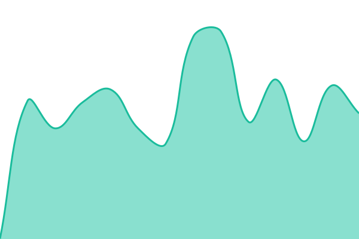 400ms
     
 | 

<a href="https://upptime.harryliu.dev/history/production-code-server">100.00%</a>
    

|  [production-drive](https://drive.harryliu.dev/) | 🟩 Up | [production-drive.yml](https://github.com/iamharryliu/uptime/commits/HEAD/history/production-drive.yml) | 

 380ms
     
 | 

<a href="https://upptime.harryliu.dev/history/production-drive">100.00%</a>
    

|  [production-nx-cache](https://nx-cache.harryliu.dev/health) | 🟩 Up | [production-nx-cache.yml](https://github.com/iamharryliu/uptime/commits/HEAD/history/production-nx-cache.yml) | 

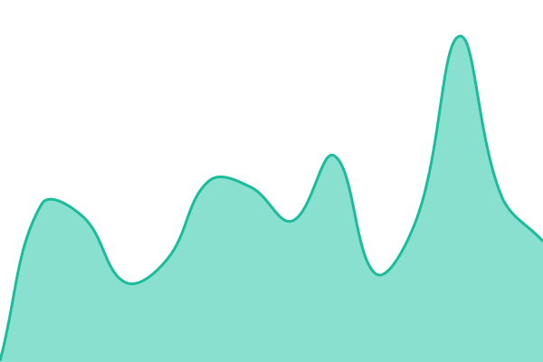 114ms
     
 | 

<a href="https://upptime.harryliu.dev/history/production-nx-cache">100.00%</a>
    

|  [production-observability-vm](https://loki.harryliu.dev/health) | 🟩 Up | [production-observability-vm.yml](https://github.com/iamharryliu/uptime/commits/HEAD/history/production-observability-vm.yml) | 

 489ms
     
 | 

<a href="https://upptime.harryliu.dev/history/production-observability-vm">100.00%</a>
    

|  [production-socket-server](https://socket.harryliu.dev/health) | 🟩 Up | [production-socket-server.yml](https://github.com/iamharryliu/uptime/commits/HEAD/history/production-socket-server.yml) | 

 134ms
     
 | 

<a href="https://upptime.harryliu.dev/history/production-socket-server">100.00%</a>
    

|  [production-findme](https://findme.harryliu.dev/) | 🟩 Up | [production-findme.yml](https://github.com/iamharryliu/uptime/commits/HEAD/history/production-findme.yml) | 

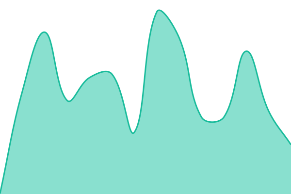 300ms
     
 | 

<a href="https://upptime.harryliu.dev/history/production-findme">100.00%</a>
    

|  [production-hearth](https://production-hearth.vercel.app/login) | 🟩 Up | [production-hearth.yml](https://github.com/iamharryliu/uptime/commits/HEAD/history/production-hearth.yml) | 

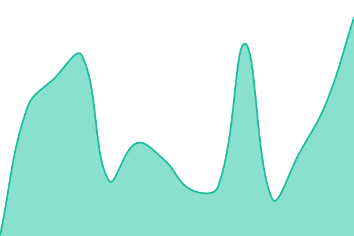 312ms
     
 | 

<a href="https://upptime.harryliu.dev/history/production-hearth">100.00%</a>
    

|  [production-service-manager](https://api.harryliu.dev/) | 🟩 Up | [production-service-manager.yml](https://github.com/iamharryliu/uptime/commits/HEAD/history/production-service-manager.yml) | 

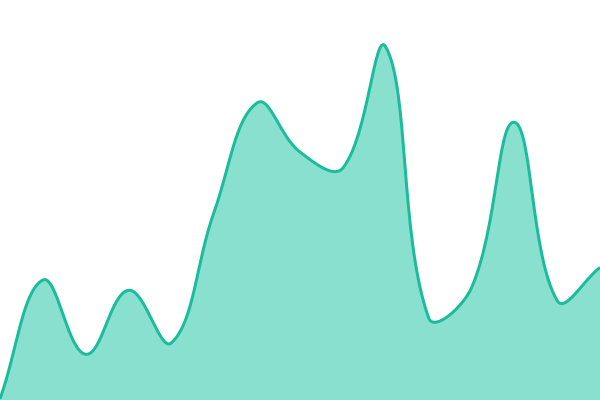 146ms
     
 | 

<a href="https://upptime.harryliu.dev/history/production-service-manager">100.00%</a>
    

|  [production-component-library](https://components.harryliu.dev/) | 🟩 Up | [production-component-library.yml](https://github.com/iamharryliu/uptime/commits/HEAD/history/production-component-library.yml) | 

 352ms
     
 | 

<a href="https://upptime.harryliu.dev/history/production-component-library">44.80%</a>
    

|  [production-utilities](https://utilities.harryliu.dev/) | 🟩 Up | [production-utilities.yml](https://github.com/iamharryliu/uptime/commits/HEAD/history/production-utilities.yml) | 

 188ms
     
 | 

<a href="https://upptime.harryliu.dev/history/production-utilities">100.00%</a>
    

|  [production-whiteboard](https://whiteboard.harryliu.dev/) | 🟩 Up | [production-whiteboard.yml](https://github.com/iamharryliu/uptime/commits/HEAD/history/production-whiteboard.yml) | 

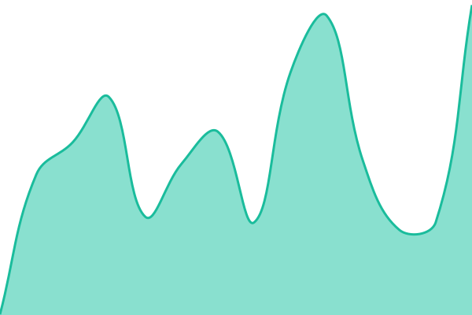 254ms
     
 | 

<a href="https://upptime.harryliu.dev/history/production-whiteboard">100.00%</a>
    

|  [production-weather](https://weather.harryliu.dev/) | 🟩 Up | [production-weather.yml](https://github.com/iamharryliu/uptime/commits/HEAD/history/production-weather.yml) | 

 158ms
     
 | 

<a href="https://upptime.harryliu.dev/history/production-weather">100.00%</a>
    

|  [production-vb-manager-next-mobile](https://production-vb-manager-next-mobile.vercel.app/login) | 🟩 Up | [production-vb-manager-next-mobile.yml](https://github.com/iamharryliu/uptime/commits/HEAD/history/production-vb-manager-next-mobile.yml) | 

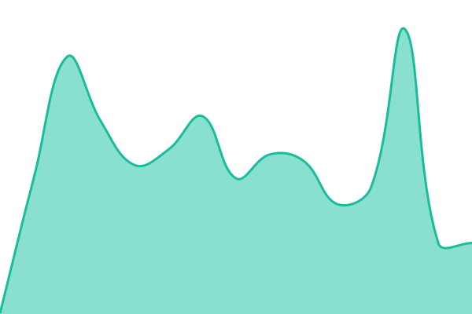 254ms
     
 | 

<a href="https://upptime.harryliu.dev/history/production-vb-manager-next-mobile">100.00%</a>
    

|  [production-docs](https://docs.harryliu.dev/) | 🟩 Up | [production-docs.yml](https://github.com/iamharryliu/uptime/commits/HEAD/history/production-docs.yml) | 

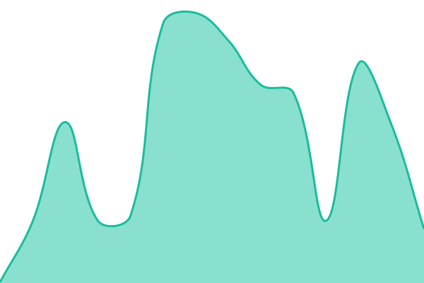 188ms
     
 | 

<a href="https://upptime.harryliu.dev/history/production-docs">100.00%</a>
    

|  [production-context](https://context.harryliu.dev/) | 🟩 Up | [production-context.yml](https://github.com/iamharryliu/uptime/commits/HEAD/history/production-context.yml) | 

 304ms
     
 | 

<a href="https://upptime.harryliu.dev/history/production-context">100.00%</a>
    

|  [production-links](https://links.harryliu.dev/) | 🟩 Up | [production-links.yml](https://github.com/iamharryliu/uptime/commits/HEAD/history/production-links.yml) | 

 145ms
     
 | 

<a href="https://upptime.harryliu.dev/history/production-links">100.00%</a>
    

|  [demo-employee-handler-ui](https://demo-employee-handler-ui.vercel.app/) | 🟩 Up | [demo-employee-handler-ui.yml](https://github.com/iamharryliu/uptime/commits/HEAD/history/demo-employee-handler-ui.yml) | 

 420ms
     
 | 

<a href="https://upptime.harryliu.dev/history/demo-employee-handler-ui">100.00%</a>
    

<!--end: status pages-->

## Management

- Configuration and workflow sources: `infrastructure/upptime/` and `.upptimerc.yml` in vigilant-broccoli.
- Checks: [monitoring workflows](https://github.com/iamharryliu/uptime/actions).
- Incidents: [issues](https://github.com/iamharryliu/uptime/issues).
- Credentials: repository-scoped temporary `GITHUB_TOKEN` only; no Vault, GCP, or application deployment credentials.
- Schedules activate after migration; manual runs are available for verification.
- Update configuration in the source repository. The sync preserves generated history and the status table above.
