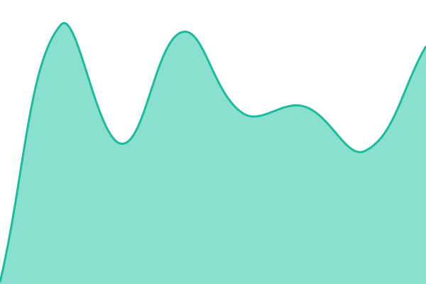

# Service Status

Public uptime checks and incident history managed by [vigilant-broccoli](https://github.com/iamharryliu/vigilant-broccoli).

## Table of Contents

- [Service Status](#service-status)
- [Management](#management)

## Service Status

<!--start: status pages-->
<!-- This summary is generated by Upptime (https://github.com/upptime/upptime) -->
<!-- Do not edit this manually, your changes will be overwritten -->
<!-- prettier-ignore -->
| URL | Status | History | Response Time | Uptime |
| --- | ------ | ------- | ------------- | ------ |
|  [staging-docs](https://staging-docs-md.pages.dev/) | 🟩 Up | [staging-docs.yml](https://github.com/iamharryliu/uptime/commits/HEAD/history/staging-docs.yml) | 

 99ms
     
 | 

<a href="https://uptime.harryliu.dev/history/staging-docs">100.00%</a>
    

|  [staging-context](https://staging-context-md.pages.dev/) | 🟩 Up | [staging-context.yml](https://github.com/iamharryliu/uptime/commits/HEAD/history/staging-context.yml) | 

 99ms
     
 | 

<a href="https://uptime.harryliu.dev/history/staging-context">100.00%</a>
    

|  [staging-bookmarks](https://staging-bookmarks-react.pages.dev/) | 🟩 Up | [staging-bookmarks.yml](https://github.com/iamharryliu/uptime/commits/HEAD/history/staging-bookmarks.yml) | 

 108ms
     
 | 

<a href="https://uptime.harryliu.dev/history/staging-bookmarks">95.38%</a>
    

|  [staging-pomodoro](https://staging-pomodoro-react.pages.dev/) | 🟩 Up | [staging-pomodoro.yml](https://github.com/iamharryliu/uptime/commits/HEAD/history/staging-pomodoro.yml) | 

 101ms
     
 | 

<a href="https://uptime.harryliu.dev/history/staging-pomodoro">100.00%</a>
    

|  [staging-cloud-8-skate](https://staging-cloud-8-skate-react.pages.dev/) | 🟩 Up | [staging-cloud-8-skate.yml](https://github.com/iamharryliu/uptime/commits/HEAD/history/staging-cloud-8-skate.yml) | 

 109ms
     
 | 

<a href="https://uptime.harryliu.dev/history/staging-cloud-8-skate">100.00%</a>
    

|  [staging-harryliu-dev](https://staging-harryliu-dev-react.pages.dev/) | 🟩 Up | [staging-harryliu-dev.yml](https://github.com/iamharryliu/uptime/commits/HEAD/history/staging-harryliu-dev.yml) | 

 104ms
     
 | 

<a href="https://uptime.harryliu.dev/history/staging-harryliu-dev">100.00%</a>
    

|  [staging-harryliu-dev-resume](https://staging-harryliu-dev-react.pages.dev/resume) | 🟩 Up | [staging-harryliu-dev-resume.yml](https://github.com/iamharryliu/uptime/commits/HEAD/history/staging-harryliu-dev-resume.yml) | 

 59ms
     
 | 

<a href="https://uptime.harryliu.dev/history/staging-harryliu-dev-resume">100.00%</a>
    

|  [staging-findme](https://staging-findme.pages.dev/) | 🟩 Up | [staging-findme.yml](https://github.com/iamharryliu/uptime/commits/HEAD/history/staging-findme.yml) | 

 101ms
     
 | 

<a href="https://uptime.harryliu.dev/history/staging-findme">100.00%</a>
    

|  [staging-hearth](https://staging-hearth.vercel.app/login) | 🟩 Up | [staging-hearth.yml](https://github.com/iamharryliu/uptime/commits/HEAD/history/staging-hearth.yml) | 

 124ms
     
 | 

<a href="https://uptime.harryliu.dev/history/staging-hearth">100.00%</a>
    

|  [staging-service-manager](https://staging-vb-express.fly.dev/) | 🟩 Up | [staging-service-manager.yml](https://github.com/iamharryliu/uptime/commits/HEAD/history/staging-service-manager.yml) | 

 112ms
     
 | 

<a href="https://uptime.harryliu.dev/history/staging-service-manager">100.00%</a>
    

|  [staging-component-library](https://staging-component-library.pages.dev/) | 🟩 Up | [staging-component-library.yml](https://github.com/iamharryliu/uptime/commits/HEAD/history/staging-component-library.yml) | 

 109ms
     
 | 

<a href="https://uptime.harryliu.dev/history/staging-component-library">100.00%</a>
    

|  [staging-utilities](https://staging-utilities-ui.pages.dev/) | 🟩 Up | [staging-utilities.yml](https://github.com/iamharryliu/uptime/commits/HEAD/history/staging-utilities.yml) | 

 94ms
     
 | 

<a href="https://uptime.harryliu.dev/history/staging-utilities">100.00%</a>
    

|  [staging-waiting-games](https://staging-waiting-games.pages.dev/) | 🟩 Up | [staging-waiting-games.yml](https://github.com/iamharryliu/uptime/commits/HEAD/history/staging-waiting-games.yml) | 

 89ms
     
 | 

<a href="https://uptime.harryliu.dev/history/staging-waiting-games">100.00%</a>
    

|  [staging-whiteboard](https://staging-whiteboard.pages.dev/) | 🟩 Up | [staging-whiteboard.yml](https://github.com/iamharryliu/uptime/commits/HEAD/history/staging-whiteboard.yml) | 

 90ms
     
 | 

<a href="https://uptime.harryliu.dev/history/staging-whiteboard">100.00%</a>
    

|  [staging-weather](https://staging-weather-next.vercel.app/) | 🟩 Up | [staging-weather.yml](https://github.com/iamharryliu/uptime/commits/HEAD/history/staging-weather.yml) | 

 149ms
     
 | 

<a href="https://uptime.harryliu.dev/history/staging-weather">100.00%</a>
    

|  [staging-balloono](https://staging-balloono.vercel.app/) | 🟩 Up | [staging-balloono.yml](https://github.com/iamharryliu/uptime/commits/HEAD/history/staging-balloono.yml) | 

 179ms
     
 | 

<a href="https://uptime.harryliu.dev/history/staging-balloono">100.00%</a>
    

|  [staging-calendars](https://staging-calendars.pages.dev/) | 🟩 Up | [staging-calendars.yml](https://github.com/iamharryliu/uptime/commits/HEAD/history/staging-calendars.yml) | 

 99ms
     
 | 

<a href="https://uptime.harryliu.dev/history/staging-calendars">100.00%</a>
    

|  [staging-vb-manager-next-mobile](https://staging-vb-manager-next-mobile.vercel.app/login) | 🟩 Up | [staging-vb-manager-next-mobile.yml](https://github.com/iamharryliu/uptime/commits/HEAD/history/staging-vb-manager-next-mobile.yml) | 

 141ms
     
 | 

<a href="https://uptime.harryliu.dev/history/staging-vb-manager-next-mobile">100.00%</a>
    

|  [production-cloud-8-skate](https://cloud8skate.com/) | 🟩 Up | [production-cloud-8-skate.yml](https://github.com/iamharryliu/uptime/commits/HEAD/history/production-cloud-8-skate.yml) | 

 190ms
     
 | 

<a href="https://uptime.harryliu.dev/history/production-cloud-8-skate">100.00%</a>
    

|  [production-harryliu-dev](https://harryliu.dev/) | 🟩 Up | [production-harryliu-dev.yml](https://github.com/iamharryliu/uptime/commits/HEAD/history/production-harryliu-dev.yml) | 

 245ms
     
 | 

<a href="https://uptime.harryliu.dev/history/production-harryliu-dev">100.00%</a>
    

|  [production-harryliu-dev-resume](https://harryliu.dev/resume) | 🟩 Up | [production-harryliu-dev-resume.yml](https://github.com/iamharryliu/uptime/commits/HEAD/history/production-harryliu-dev-resume.yml) | 

 150ms
     
 | 

<a href="https://uptime.harryliu.dev/history/production-harryliu-dev-resume">100.00%</a>
    

|  [production-git](https://git.harryliu.dev/) | 🟩 Up | [production-git.yml](https://github.com/iamharryliu/uptime/commits/HEAD/history/production-git.yml) | 

 557ms
     
 | 

<a href="https://uptime.harryliu.dev/history/production-git">100.00%</a>
    

|  [production-code-server](https://code.harryliu.dev/login) | 🟩 Up | [production-code-server.yml](https://github.com/iamharryliu/uptime/commits/HEAD/history/production-code-server.yml) | 

 391ms
     
 | 

<a href="https://uptime.harryliu.dev/history/production-code-server">100.00%</a>
    

|  [production-web-terminal](https://shell.harryliu.dev/) | 🟩 Up | [production-web-terminal.yml](https://github.com/iamharryliu/uptime/commits/HEAD/history/production-web-terminal.yml) | 

 105ms
     
 | 

<a href="https://uptime.harryliu.dev/history/production-web-terminal">100.00%</a>
    

|  [production-drive](https://drive.harryliu.dev/) | 🟩 Up | [production-drive.yml](https://github.com/iamharryliu/uptime/commits/HEAD/history/production-drive.yml) | 

 421ms
     
 | 

<a href="https://uptime.harryliu.dev/history/production-drive">100.00%</a>
    

|  [production-nx-cache](https://nx-cache.harryliu.dev/health) | 🟩 Up | [production-nx-cache.yml](https://github.com/iamharryliu/uptime/commits/HEAD/history/production-nx-cache.yml) | 

 113ms
     
 | 

<a href="https://uptime.harryliu.dev/history/production-nx-cache">100.00%</a>
    

|  [production-observability-vm](https://loki.harryliu.dev/health) | 🟩 Up | [production-observability-vm.yml](https://github.com/iamharryliu/uptime/commits/HEAD/history/production-observability-vm.yml) | 

 528ms
     
 | 

<a href="https://uptime.harryliu.dev/history/production-observability-vm">100.00%</a>
    

|  [production-socket-server](https://socket.harryliu.dev/health) | 🟩 Up | [production-socket-server.yml](https://github.com/iamharryliu/uptime/commits/HEAD/history/production-socket-server.yml) | 

 179ms
     
 | 

<a href="https://uptime.harryliu.dev/history/production-socket-server">100.00%</a>
    

|  [production-findme](https://findme.harryliu.dev/) | 🟩 Up | [production-findme.yml](https://github.com/iamharryliu/uptime/commits/HEAD/history/production-findme.yml) | 

 209ms
     
 | 

<a href="https://uptime.harryliu.dev/history/production-findme">100.00%</a>
    

|  [production-hearth](https://hearth.harryliu.dev/login) | 🟩 Up | [production-hearth.yml](https://github.com/iamharryliu/uptime/commits/HEAD/history/production-hearth.yml) | 

 329ms
     
 | 

<a href="https://uptime.harryliu.dev/history/production-hearth">97.13%</a>
    

|  [production-service-manager](https://api.harryliu.dev/) | 🟩 Up | [production-service-manager.yml](https://github.com/iamharryliu/uptime/commits/HEAD/history/production-service-manager.yml) | 

 441ms
     
 | 

<a href="https://uptime.harryliu.dev/history/production-service-manager">100.00%</a>
    

|  [production-component-library](https://components.harryliu.dev/) | 🟩 Up | [production-component-library.yml](https://github.com/iamharryliu/uptime/commits/HEAD/history/production-component-library.yml) | 

 219ms
     
 | 

<a href="https://uptime.harryliu.dev/history/production-component-library">100.00%</a>
    

|  [production-utilities](https://utilities.harryliu.dev/) | 🟩 Up | [production-utilities.yml](https://github.com/iamharryliu/uptime/commits/HEAD/history/production-utilities.yml) | 

 186ms
     
 | 

<a href="https://uptime.harryliu.dev/history/production-utilities">100.00%</a>
    

|  [production-waiting-games](https://waiting.harryliu.dev/) | 🟩 Up | [production-waiting-games.yml](https://github.com/iamharryliu/uptime/commits/HEAD/history/production-waiting-games.yml) | 

 157ms
     
 | 

<a href="https://uptime.harryliu.dev/history/production-waiting-games">100.00%</a>
    

|  [production-whiteboard](https://whiteboard.harryliu.dev/) | 🟩 Up | [production-whiteboard.yml](https://github.com/iamharryliu/uptime/commits/HEAD/history/production-whiteboard.yml) | 

 194ms
     
 | 

<a href="https://uptime.harryliu.dev/history/production-whiteboard">100.00%</a>
    

|  [production-weather](https://weather.harryliu.dev/) | 🟩 Up | [production-weather.yml](https://github.com/iamharryliu/uptime/commits/HEAD/history/production-weather.yml) | 

 354ms
     
 | 

<a href="https://uptime.harryliu.dev/history/production-weather">100.00%</a>
    

|  [production-balloono](https://balloono.harryliu.dev/) | 🟩 Up | [production-balloono.yml](https://github.com/iamharryliu/uptime/commits/HEAD/history/production-balloono.yml) | 

 307ms
     
 | 

<a href="https://uptime.harryliu.dev/history/production-balloono">100.00%</a>
    

|  [production-calendars](https://calendar.harryliu.dev/) | 🟩 Up | [production-calendars.yml](https://github.com/iamharryliu/uptime/commits/HEAD/history/production-calendars.yml) | 

 184ms
     
 | 

<a href="https://uptime.harryliu.dev/history/production-calendars">100.00%</a>
    

|  [production-vb-manager-next-mobile](https://manager.harryliu.dev/login) | 🟩 Up | [production-vb-manager-next-mobile.yml](https://github.com/iamharryliu/uptime/commits/HEAD/history/production-vb-manager-next-mobile.yml) | 

 271ms
     
 | 

<a href="https://uptime.harryliu.dev/history/production-vb-manager-next-mobile">100.00%</a>
    

|  [production-career](https://career.harryliu.dev/) | 🟩 Up | [production-career.yml](https://github.com/iamharryliu/uptime/commits/HEAD/history/production-career.yml) | 

 327ms
     
 | 

<a href="https://uptime.harryliu.dev/history/production-career">100.00%</a>
    

|  [production-deployments](https://deployments.harryliu.dev/) | 🟩 Up | [production-deployments.yml](https://github.com/iamharryliu/uptime/commits/HEAD/history/production-deployments.yml) | 

 204ms
     
 | 

<a href="https://uptime.harryliu.dev/history/production-deployments">100.00%</a>
    

|  [production-status](https://status.harryliu.dev/) | 🟩 Up | [production-status.yml](https://github.com/iamharryliu/uptime/commits/HEAD/history/production-status.yml) | 

 175ms
     
 | 

<a href="https://uptime.harryliu.dev/history/production-status">100.00%</a>
    

|  [production-uptime](https://uptime.harryliu.dev/) | 🟩 Up | [production-uptime.yml](https://github.com/iamharryliu/uptime/commits/HEAD/history/production-uptime.yml) | 

 172ms
     
 | 

<a href="https://uptime.harryliu.dev/history/production-uptime">100.00%</a>
    

|  [production-docs](https://docs.harryliu.dev/) | 🟩 Up | [production-docs.yml](https://github.com/iamharryliu/uptime/commits/HEAD/history/production-docs.yml) | 

 179ms
     
 | 

<a href="https://uptime.harryliu.dev/history/production-docs">100.00%</a>
    

|  [production-context](https://context.harryliu.dev/) | 🟩 Up | [production-context.yml](https://github.com/iamharryliu/uptime/commits/HEAD/history/production-context.yml) | 

 181ms
     
 | 

<a href="https://uptime.harryliu.dev/history/production-context">100.00%</a>
    

|  [production-bookmarks](https://bookmarks.harryliu.dev/) | 🟩 Up | [production-bookmarks.yml](https://github.com/iamharryliu/uptime/commits/HEAD/history/production-bookmarks.yml) | 

 170ms
     
 | 

<a href="https://uptime.harryliu.dev/history/production-bookmarks">95.39%</a>
    

|  [production-pomodoro](https://pomodoro.harryliu.dev/) | 🟩 Up | [production-pomodoro.yml](https://github.com/iamharryliu/uptime/commits/HEAD/history/production-pomodoro.yml) | 

 180ms
     
 | 

<a href="https://uptime.harryliu.dev/history/production-pomodoro">100.00%</a>
    

|  [demo-employee-handler-ui](https://demo-employee-handler-ui.vercel.app/) | 🟩 Up | [demo-employee-handler-ui.yml](https://github.com/iamharryliu/uptime/commits/HEAD/history/demo-employee-handler-ui.yml) | 

 354ms
     
 | 

<a href="https://uptime.harryliu.dev/history/demo-employee-handler-ui">100.00%</a>
    

|  [demo-office-presence-ui](https://demo-office-presence-ui.pages.dev/) | 🟩 Up | [demo-office-presence-ui.yml](https://github.com/iamharryliu/uptime/commits/HEAD/history/demo-office-presence-ui.yml) | 

 350ms
     
 | 

<a href="https://uptime.harryliu.dev/history/demo-office-presence-ui">100.00%</a>
    

<!--end: status pages-->

## Management

- Configuration and workflow sources: `infrastructure/upptime/` and `.upptimerc.yml` in vigilant-broccoli.
- Checks: [monitoring workflows](https://github.com/iamharryliu/uptime/actions).
- Incidents: [issues](https://github.com/iamharryliu/uptime/issues).
- Credentials: repository-scoped temporary `GITHUB_TOKEN` only; no Vault, GCP, or application deployment credentials.
- Schedules activate after migration; manual runs are available for verification.
- Update configuration in the source repository. The sync preserves generated history and the status table above.
